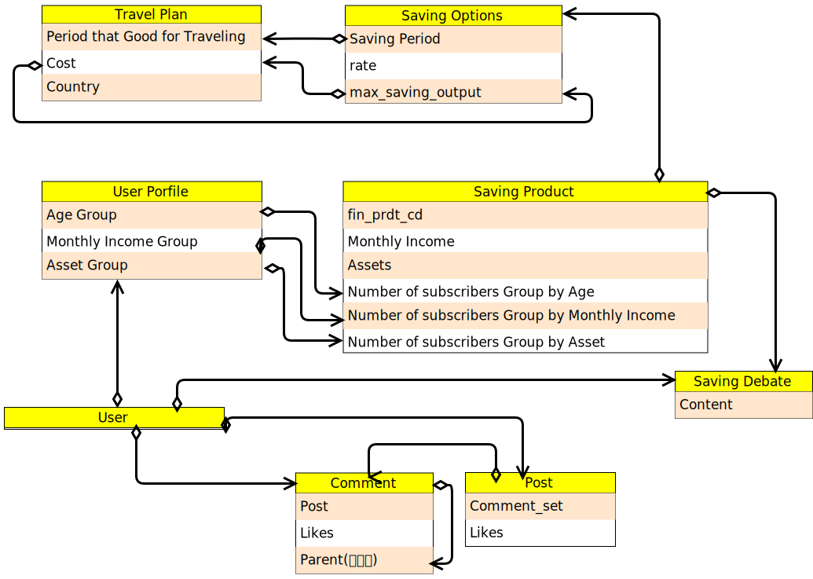

# Project: Bank radar

____

# Bank Radar 서비스 설명

Bank Radar는 개인의 선호도와 향후 계획을 바탕으로 예금과 저축에 대한 맞춤형 추천을 제공하는 혁신적인 서비스입니다.

인기 있는 저축 상품을 찾아 추천해 줄 뿐만 아니라, 이를 사용자의 여행 열망과 통합하는 데 중점을 두고 있습니다.

_____

## 서비스 대상

- **여행을 즐기며 돈도 아끼는 특별한 방법을 찾는 사람들**

  여행을 즐기면서 돈을 아끼고 싶어하는 분들을 위해 Bank Radar가 특별한 저축 상품을 제안해요.

- **신뢰할 만한 금융 상품을 찾고 있는 투자자들**

  신뢰할 만한 금융 상품을 찾고 싶어하는 투자자들을 위해 Bank Radar가 검증된 적금 상품을 추천해줘요

- **적금 만기 후 여행을 계획하는 사람들**

  적금이 만기를 맞은 후 여행을 꿈꾸는 분들을 위해, Bank Radar가 여행지 추천을 도와줘요

- **여행을 원하지만 비용 걱정으로 망설이는 사람들**

  여행은 하고 싶지만 비용 때문에 망설이는 분들을 위해, Bank Radar가 여행 비용과 적금 상품을 추천하여 여행 계획을 지원해드려요.

#### Bank Radar는 여행 목표와 금융 목표가 조화를 이룰 수 있도록, 맞춤형 금융 조언과 여행 추천을 제공하고 있어요. 여행을 꿈꾸면서 동시에 저축을 하며, 목표를 이룰 수 있도록 돕는 게 Bank Radar의 목표입니다.

_____

## 주요 서비스

Bank Radar는 여러분이 돈을 모으고 여행을 계획할 때 필요한 정보를 제공해요. 돈을 모아가면서 여행도 즐길 수 있도록 도와드리고 있어요. Bank Radar는 여행 계획과 저축 목표에 따라 맞춤 추천을 제공합니다.

### 여행 목적지와 일정이 명확한 이들을 위해...

- **최적의 적금 추천**: Bank Radar는 여행일 전까지 최적의 적금 상품을 추천해줍니다.
  - 여행 전에 맞춤 적금 추천
  - 여행 경비를 모으기 위한 적절한 적금 옵션 추천
  - 금리, 조건, 목표 등을 고려하여 최적의 저축 방법 추천

### 적금 상품을 선택하였지만 여행지를 고민하는 이들을 위해...

- **적금 만기 후 여행 목적지 추천**: 저축한 금액과 저축 기간을 기반으로 여행지를 추천해드려요.
  - 사용자의 예산을 고려하여 최적의 여행지를 제안
  - 여행을 계획하고 금융 목표를 달성하는 데 도움

____

# 기능 목록

## 기술 스택

| 프론트 엔드                                                  | 백 엔드                                                      |
| ------------------------------------------------------------ | ------------------------------------------------------------ |
|  [Git hub](https://github.com/MunsooKang) |  [Git hub](https://github.com/Dohun-choi) |

## 기능 목록

#### 회원

- 프로필(생년월일(선택), 월 수입(선택), 자산(선택)) - 추천 알고리즘에 활용
- 작성 게시글 및 댓글 조회
- 좋아요 게시글 및 댓글 조회
- ~~좋아요~~ 가입한 예금 및 적금 상품 조회

#### 커뮤니티(게시판 CRUD)

- 게시글
  - 게시글 리스트
  - 게시글 생성
  - 게시글 수정
  - 게시글 삭제
  - 게시글 좋아요

- 댓글
  - 게시글 별 댓글 조회
  - 댓글 생성
  - 댓글 수정
  - 댓글 삭제
  - 댓글 좋아요
  - 대댓글

#### 예적금 금리 테이터

- 금융감독원 API 이용
- 예금 및 적금 데이터 서버 DB에 저장
- 예금 및 적금 전체 조회 및 상세 조회
- 예금 및 적금 ~~좋아요~~ ''가입했어요'' 기능
- ~~좋아요~~ "가입했어요" 많은 순서로 조회

#### 환율 계산

- 한국수출입은행 API 이용
- 입력 화폐 선택 및 결과 화폐 선택
- 추천 알고리즘 중 여행 경비 알고리즘에 활용

#### 추천 알고리즘

- 나이 기반 가입 상품 추천
- 월 수입 기반 가입 상품 추천
- 자산 기반 가입 상품 추천
- 가입 기간을 이용한 만기 후 여행지 추천
- 희망 여행지를 통한 적금 상품 추천

# 구현 과정

## ERD

## 컴포넌트 구조

# 추가 설명

## 해결되지 못한 이슈 및 서비스 보완 사항

### 최도훈

- 추천 알고리즘이 가입한 사람을 바탕으로 이루어 지기때문에 실제 가입 여부를 확인하는 과정이 필요하다. 현재의 알고리즘은 별도의 인증없이 자신이 가입했다고 표시 가능하기 때문에 실제 가입자와 Bank Radar의 가입자의 데이터는 큰 차이가 날 수 있다. 각 상품별 가입자 수 정보를 받아 올 방법이 필요하다.
- 여행지에 대한 정보가 부족하다. 만기 후 여행하기 좋은 나라를 만기 후의 월(Month) 기준으로 추천한다. 도시 혹은 즐길 수 있는 actibity 등으로 세분화하여 더욱 구체적인 동시에 유저의 관심을 끌 수 있는 여행지 추천이 되었으면 한다. 그러기 위해서는 여행과 관련된 정보를 훨씬 더 많이 모을 필요가 있다. 더불어 여행 예상 비용을 산출할때, 여행 기간 및 숙소 선호 등을 바탕으로 더욱 구체적인 플랜을 추천해 줄 필요가 있다.
- 현재 적금 옵션에 따라 최고 한도만큼 매달 적금하였을 때를 기준으로 적금 만기 비용을 추산하는데, 유저가 실제 적금액을 바탕으로 추천하여야 더욱 정확하다.

### 강문수

## commit 규칙

feat: 새로운 기능 추가
remove: 기능 삭제
fix: 버그 수정
docs: 문서 수정
refactor: 리팩터링
rename: 파일명 또는 폴더명 수정
comment: 오타 수정, 주석 수정
design: \[프론트\] 디자인 수정
